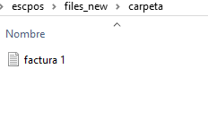
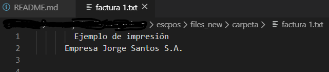

# escpos
Print in star tsp100 printer using escpost dependency.

## Requirements
1. Nodejs v12.11.1
2. express 4.17.1
3. [escpos 2.5.2](https://www.npmjs.com/package/escpos)

Note: Not forget install Zadig if you use windows OS

# Print 

The file example to test the printer should be created in the directory files_new/archivos/factura1.txt

The file content should be the following

